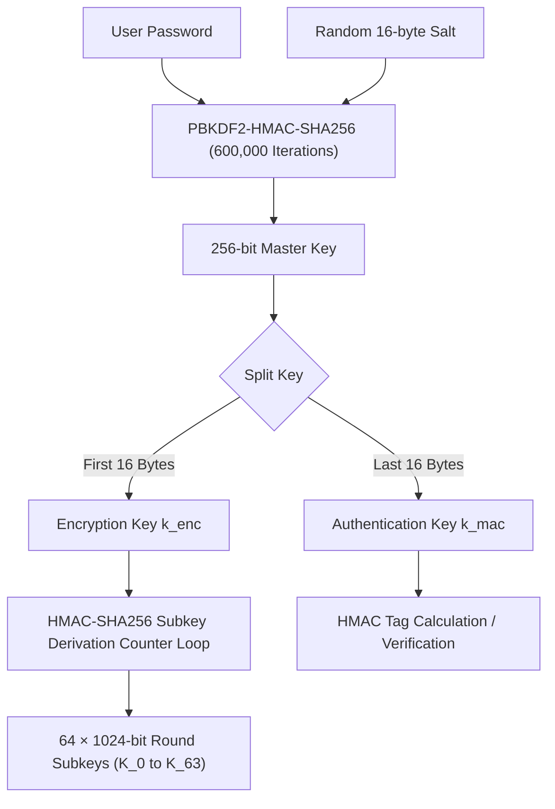
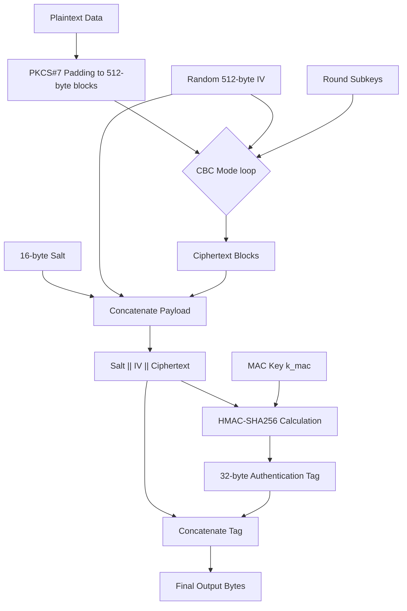

# Cryptographic Flow Diagrams

This document contains flowcharts and block diagrams of the main execution flows within the cipher, detailing key derivation, GFN round structure, round function internals, and the Encrypt-then-MAC process.

---

## 1. Key Derivation & Initialization Flow

This flow shows how the user's password and a random salt are converted into the encryption and MAC keys, and how the subkeys are generated.



---

## 2. Overall Authenticated Encryption (Encrypt-then-MAC)

This flow details the sequence of processing a plaintext payload into the final authenticated ciphertext structure.



---

## 3. GFN Round State Propagation (Type-II 4-Branch)

This diagram shows how the four 1024-bit branches of the 4096-bit block are processed and cyclic-shifted in each round.

```
       Block Input (4096 bits)
       ├─── Word 0 (1024-bit) ──►  X_0
       ├─── Word 1 (1024-bit) ──►  X_1 ──┐
       ├─── Word 2 (1024-bit) ──►  X_2   │
       └─── Word 3 (1024-bit) ──►  X_3 ──┼─┐
                                         │ │
      ┌──────────────────────────────────┘ │
      │                                    │
      ▼                                    ▼
    ┌───┐                                ┌───┐
    │ F │ ◄─── Round Subkey K_2r         │ F │ ◄─── Round Subkey K_2r+1
    └───┘                                └───┘
      │                                    │
      ▼                                    ▼
    ┌───┐                                ┌───┐
    │XOR│ ◄─── X_0                       │XOR│ ◄─── X_2
    └───┘                                └───┘
      │                                    │
      ▼ (y_0)                              ▼ (y_2)
      │                                    │
      │   ┌────────────────────────────────┘
      │   │
      │   │   ┌────────────────────────────┐
      │   │   │                            │
      ▼   ▼   ▼                            ▼
     [Branch Shuffling / Left Cyclic Shift]
      │   │   │                            │
      ▼   ▼   ▼                            ▼
    X_0  X_1 X_2                          X_3   (Next Round Inputs)
   (X_1) (y_2)(X_3)                      (y_0)
```

---

## 4. Round Function $F(X, K)$ Step-by-Step

This diagram traces the operations performed inside a single round function $F$ on a 1024-bit word.

```
               Word Input X (128 bytes)
                          │
                          ▼
            XOR with 128-byte Round Subkey K
                          │
                          ▼
            AES S-Box Substitution (128 times)
             [ x_i = SBOX[ x_i ] for i in 0..127 ]
                          │
                          ▼
               1024-bit Bit Permutation
            [ Shuffles all 1024 bits individually ]
                          │
                          ▼
               Linear Mixing Layer
             - Split into 16 x 64-bit subwords: W_0..W_15
             - Apply Circular Rotations & XOR:
               W_i = W_i ^ (W_next <<< 17) ^ (W_next5 <<< 31)
                          │
                          ▼
               Output Word (128 bytes)
```
